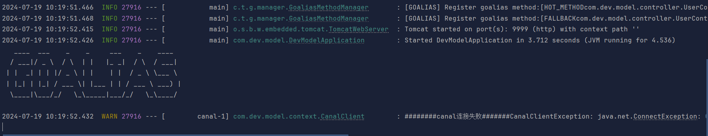

## author: Goalias-G


### 项目地址：https://github.com/Goalias-G/Goalias_DevFrame

### 介绍

Goalias_DevFrame 是一个用于快速构建和开发Spring Boot应用的多位一体解决方案，配备完整的aop接口日志、开发工具、业务框架、限流降级器（GoaliasLimiter）、多服务配置与示例... 更多用法等你探索！


### 使用

使用git clone 保存本项目到本地，根据你的喜好配置application.yml,包括且不限于mysql、redis、mp、minio、canal、docker...

限流器（GoaliasLimiter）的使用请移步 -> https://github.com/Goalias-G/GoaliasLimiter

next -> 快速开发你领先在起跑线的项目!

### 目录结构
```
Goalias_DevModel
├─ .gitignore
├─ Dockerfile
├─ README.md
├─ canal.properties
├─ doc
├─ docker-compose.yml
├─ lombok.config
├─ pom.xml
├─ src
│  ├─ main
│  │  ├─ java
│  │  │  └─ com
│  │  │     └─ dev
│  │  │        └─ model
│  │  │           ├─ DevModelApplication.java
│  │  │           ├─ event          spring事件监听器
│  │  │           ├─ aop            
│  │  │           ├─ canal          canal处理Handler
│  │  │           ├─ config         
│  │  │           ├─ context            应用上下文
│  │  │           │  ├─ context
│  │  │           │  ├─ exception
│  │  │           │  └─ properties
│  │  │           ├─ controller
│  │  │           ├─ interceptor
│  │  │           ├─ mapper
│  │  │           ├─ pojo
│  │  │           │  ├─ dto
│  │  │           │  ├─ entity
│  │  │           │  └─ vo
│  │  │           ├─ schedule           自定义定时任务
│  │  │           ├─ service
│  │  │           │  └─ impl
│  │  │           └─ utils          工具类
│  │  └─ resources
│  │     ├─ lib
│  │     │  └─ goalias-1.0.3.jar （goaliasLimiter）
│  │     └─ mapper
│  └─ test
```
canal主要配置示例： canal.properties

docker 部署示例： Dockerfile 、 docker-compose.yml

成功启动示例：



### 🎉🎉🎉 <span style="color: orange;">代码写得好，Bug跑不了；脚手架用得好，效率少不了！</span>🚀✨😄👍💻🚀

